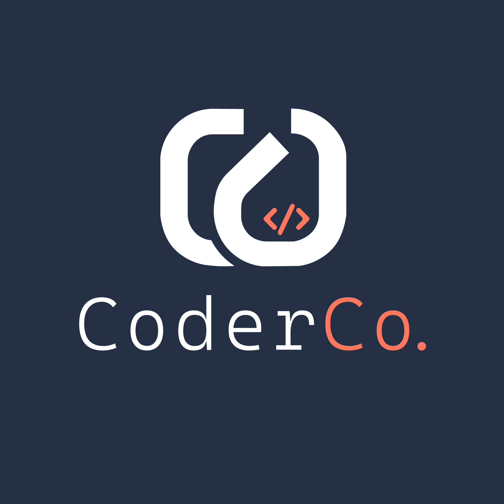

<p align="center">
  
</p>

# ECS v3 - Order Fulfillment Platform

A multi-service order platform on AWS. Nine services, one cluster. The application code is provided. You build everything else.

---

## Services

| Service | Port | Description |
|---------|------|-------------|
| **api-gateway** | 8080 | Auth, rate limiting, routes requests to internal services |
| **order-service** | 8081 | Order lifecycle and state machine |
| **inventory-service** | 8082 | Stock management and reservations |
| **payment-service** | 8083 | Payment processing, refunds, ledger |
| **notification-service** | 8084 | Email and SMS dispatch |
| **shipping-service** | 8085 | Shipments, tracking, carrier webhooks |
| **worker** | - | SQS consumer, orchestrates cross-service events |
| **scheduler** | - | Cron jobs (expired reservations, abandoned orders, retries) |
| **dashboard-api** | 8086 | Admin analytics and reporting |

Read the source code. Environment variables, endpoints, and data models are in the code.

---

## Your Job

Write the Dockerfiles. Write the Terraform. Write the CI/CD pipeline. Deploy all nine services to ECS Fargate on AWS.

### Requirements

- ECS Fargate - nine separate services, one cluster
- Application Load Balancer routing to the correct services
- RDS PostgreSQL (shared database)
- ElastiCache Redis (API gateway rate limiting and caching)
- SQS queue with dead letter queue (cross-service event bus)
- ECR repositories (one per service)
- VPC with private subnets. No NAT gateways.
- Secrets in Secrets Manager or Parameter Store - not hardcoded, not in env files
- GitHub Actions with OIDC. No long-lived AWS credentials.
- Zero-downtime deployments with rollback on failure
- Least-privilege IAM - each service gets only what it needs
- Terraform with remote state
- Multi-stage Docker builds
- Container image scanning before deploy

### Deliverables

- [ ] Dockerfiles (one per service)
- [ ] Terraform for all infrastructure
- [ ] GitHub Actions CI/CD pipeline (app deploys and infra changes separated)
- [ ] Observability (logging, metrics, alarms, dashboards)
- [ ] Working deployment - all services healthy, end-to-end flow functional
- [ ] README covering the sections below

---

## What Your README Must Cover

This is not optional. Your README is part of the submission.

**Architecture decisions** - what you built, why you built it that way, what you traded off.

**Deployment pipeline** - a developer pushes a change to the payment service. Walk through exactly what happens, from commit to live traffic. How do app deploys and infra changes stay out of each other's way? What triggers what?

**Secrets management** - nine services need database credentials, API keys, JWT secrets. How do they get them? What happens when you rotate a secret?

**Scaling strategy** - which services scale and on what metric? What stays fixed? What breaks first under load?

**Database migrations** - seven services share one database. How do schema changes get deployed safely? What about rollback?

**Observability** - how you monitor nine services. How you find problems. How you know something is broken before users tell you.

---

## Things to Consider

These aren't requirements. They're the kind of problems you'll hit in production. How you handle them is up to you.

- The worker processes events from SQS. What happens to events that fail three times?
- The payment service goes down for two minutes. What happens to in-flight orders?
- You need to add a column to the orders table. The dashboard service reads from that table. How do you deploy both without downtime?
- Nine services each open database connections. What's the max connection count on your RDS instance? What happens when you scale to three tasks per service?
- A junior dev pushes a bad image for the notification service. How quickly can you roll back without affecting the other eight?
- Fargate Spot saves money. Which services can tolerate interruption? Which absolutely cannot?
- Your logging pipeline ingests from nine services. What does that cost per month? Is there a cheaper way?
- You rotate the database password. Do all nine services restart? Is there a way to avoid that?

---

## Local Development

```bash
docker compose up --build
```

---

## Grading

- All nine services running and healthy
- End-to-end flow works (create order -> reserve inventory -> process payment -> ship -> deliver)
- Logs queryable, alarms firing on failures
- Pipeline deploys only what changed
- Secrets not hardcoded anywhere
- No NAT gateways, no long-lived credentials
- README covers all required sections with real decisions, not filler
- You can explain every resource you created

**Tear down when done.** This stack costs money idle.

Everything else is on you. Good luck.
